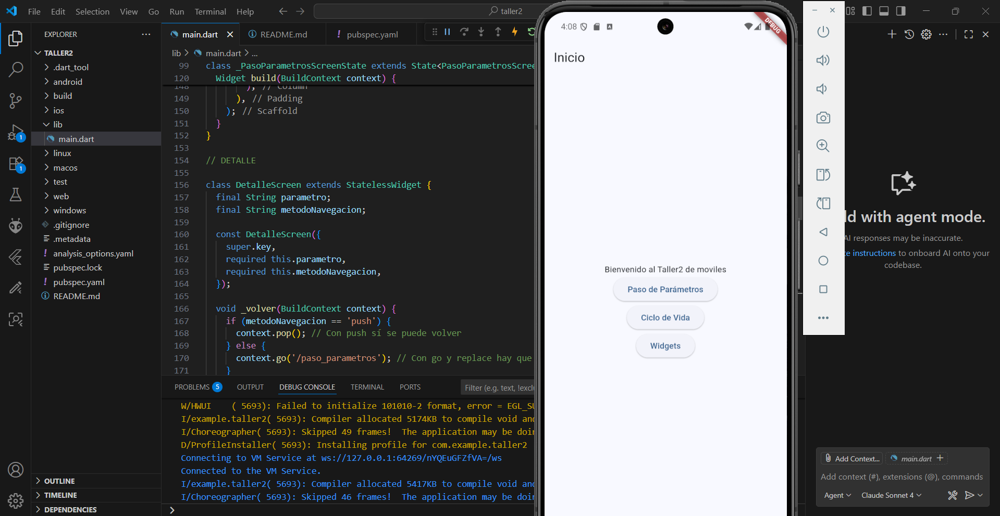
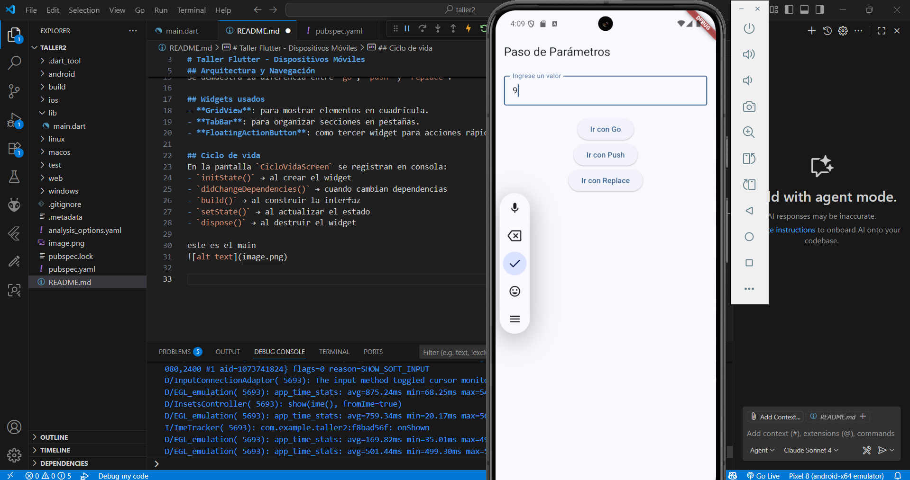
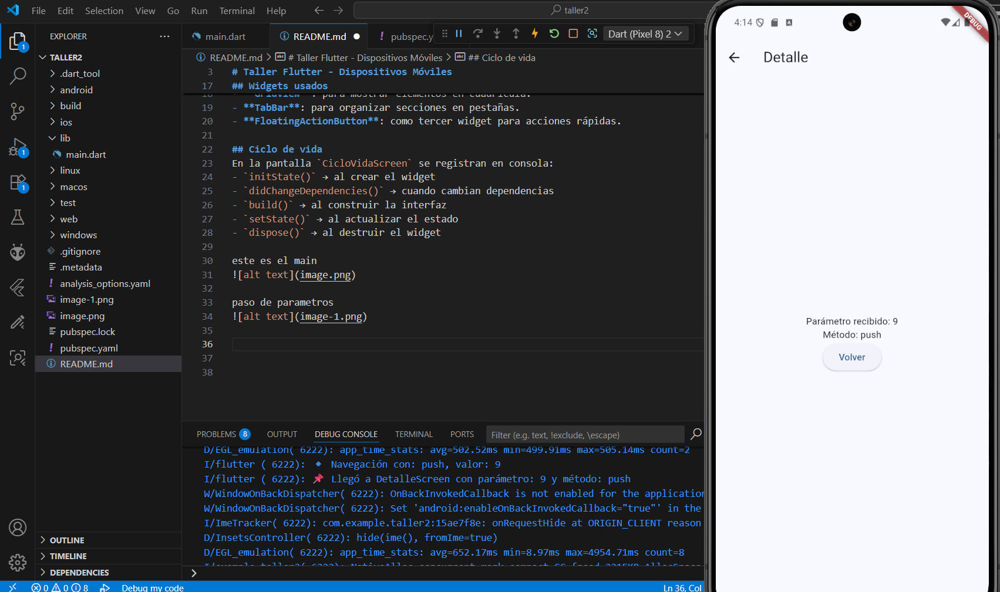
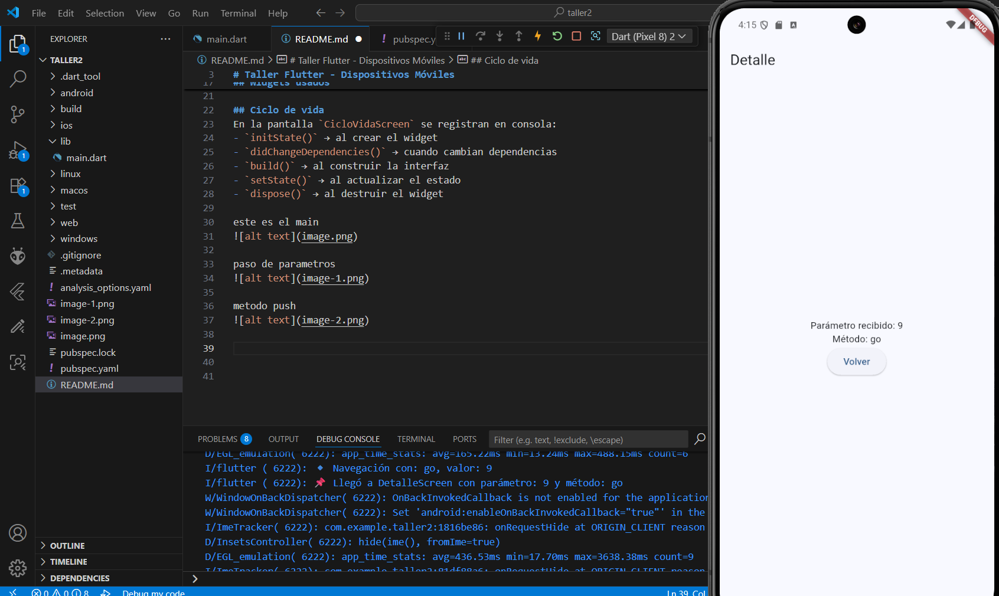
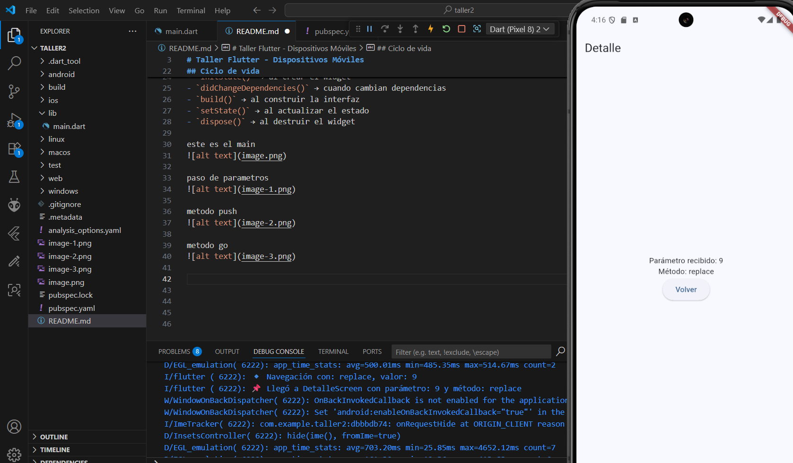
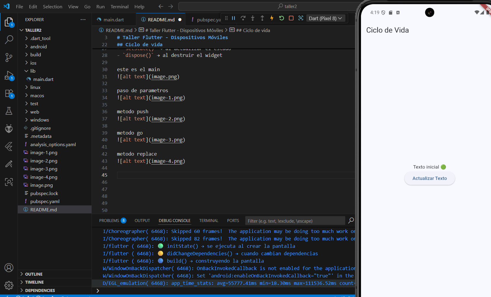
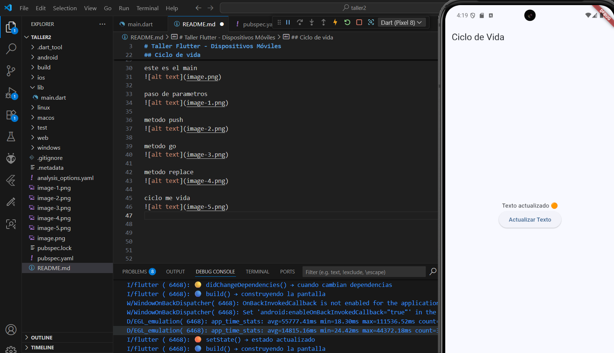
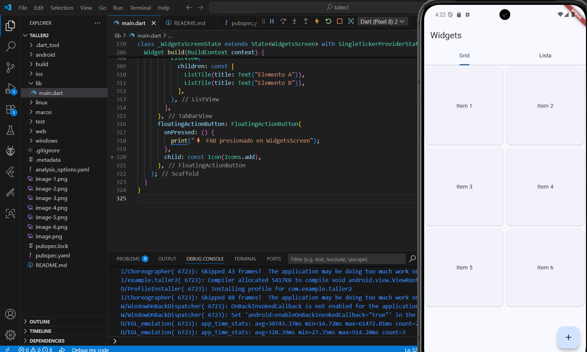
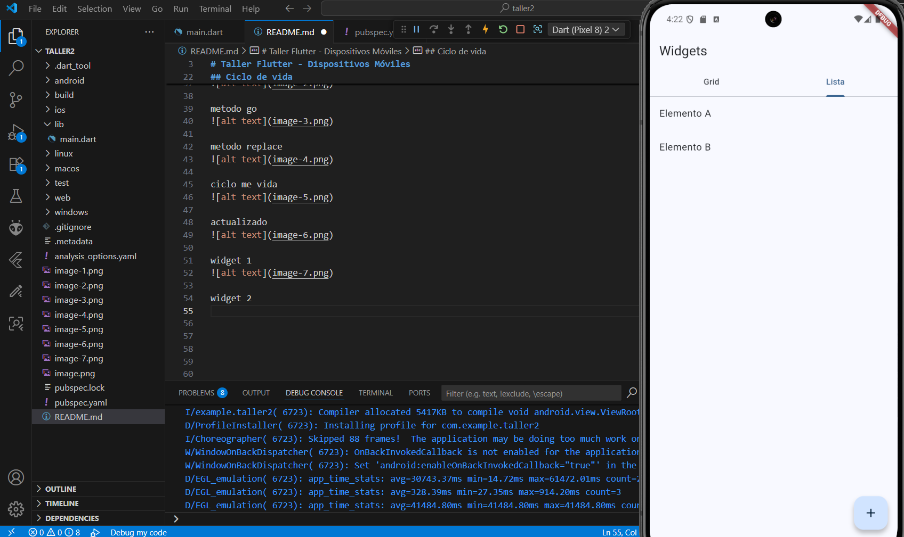
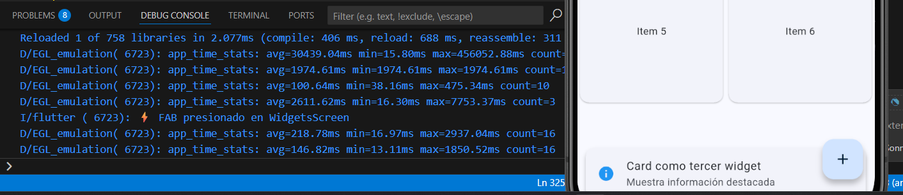

# taller2

# Taller Flutter - Dispositivos Móviles

## Arquitectura y Navegación
La navegación se implementó con `go_router`.  
Rutas utilizadas:
- `/` → Home
- `/paso_parametros` → Pantalla para ingresar y enviar valores
- `/detalle/:parametro/:metodo` → Muestra el parámetro y el método de navegación
- `/ciclo_vida` → Demostración del ciclo de vida
- `/widgets` → Ejemplo de GridView, TabBar y FloatingActionButton

Se pasa un parámetro desde la pantalla principal a la secundaria y se muestra en destino.  
Se demuestra la diferencia entre `go`, `push` y `replace`.

## Widgets usados
- **GridView**: para mostrar elementos en cuadrícula.  
- **TabBar**: para organizar secciones en pestañas.  
- **FloatingActionButton**: como tercer widget para acciones rápidas.  

## Ciclo de vida
En la pantalla `CicloVidaScreen` se registran en consola:
- `initState()` → al crear el widget  
- `didChangeDependencies()` → cuando cambian dependencias  
- `build()` → al construir la interfaz  
- `setState()` → al actualizar el estado  
- `dispose()` → al destruir el widget

este es el main

paso de parametros

metodo push

metodo go

metodo replace

ciclo me vida

actualizado

widget 1
        

widget 2

wigget 3

